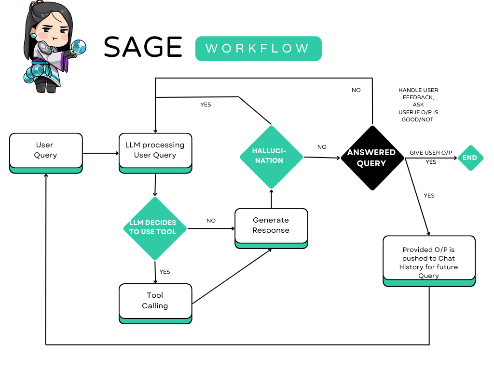

#  SAGE : Complete Code Assistant 

SAGE is a complete code assistant application based on LLM-based Agent with self evaluating capabilities to provide with best code assistance

## Work in Progress :
- 2 out of 4 major features are completely tested and working , features Web Search for code snippets and documents part in currently buggy 
- **Completed Features** :
   - Code Generation based on users idea and query
   - Code Error Handling based on users provided code snippet and error
- **Working in  progress** : 
   - Code Web Search
   - Github Repo connection, building RAG system for github repo

  

## Features :
- Contextual Code Completion

- Code Debugging and Error Handling

- Documentation and Code Search

- Knowledge Base Integration

- User-Friendly Interface

- Personalization and Memory

## Development tools :

***SAGE*** is build using **Langchain Ecosystem**(chains,graphs,prompts(from hub)) & **Streamlit** for UI , **langsmith** for all the tracing/monitoring/LLMops task required to ensure SAGE works properly with no issues. SAGE uses LLAMA3-8b-8192 provided by **GROQ**(fastest inference for LLM)

  

  

    
  

## Working/Workflow :

## SAGE's performance vs general LLM models

*general perfomance evalution metrics :-* 

| Metric               | Your LLM       | GPT-3.5 Turbo   | CodeLlama      |
|----------------------|----------------|-----------------|----------------|
| Accuracy             | 85%            | 90%             | 88%            |
| Latency (seconds)    | 1.2            | 0.8             | 1.1            |
| User Satisfaction    | 4.3/5          | 4.7/5           | 4.5/5          |
| Error Rate           | 10%            | 7%              | 8%             |
| Coverage             | Broad          | Very Broad      | Broad          |
| Documentation Search | Good           | Excellent       | Good           |
| Debugging Assistance | Moderate       | Excellent       | Good           |

#### Tools and Libraries for Evaluation
   - HumanEval: A benchmark for measuring the performance of language models on code generation tasks.
   - CodeXGLUE: A collection of benchmarks for code-related tasks.
   - Automated Testing: Use libraries like pytest for Python to automate the testing of generated code.

#### Testing Steps
   - Define Evaluation Tasks (Eg. Code completion, Error debugging,etc)
   - Select Benchmark Datasets(eg.CodeXGLUE,HumanEval)
   - Metrics (accuracy, latency,etc)
   - *Experimental Setup*
        - Initialize Models
        - Evaluation Task Execution
        - Accuracy Evaluation
        - Error Analysis
        - Report Generation

1. SAGE vs ChatGPT (**GPT-3.5 turbo**, free tier of ChatGPT)

2. SAGE vs CodeLLAMA (CODELlAMA based on LLAMA-2)